# Команда "Сибирский космос"

Team-lead Полякова Анастасия Сергеевна
Участники:
Балакирева Алиса Марковна

Кравченко Елизавета Сергеевна

Козлов Вадим Рустамович

Коновалов Дмитрий Романович

Ветка для просмотра итогового результата - main

# Кейс
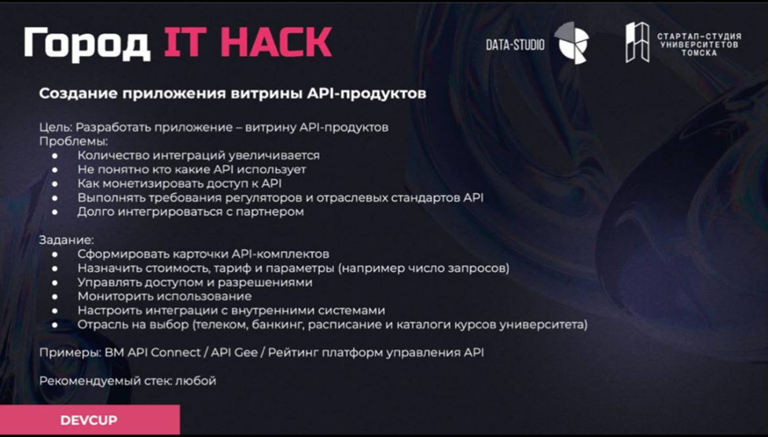
# Этапы реализации
## Требования к системе
### Функциональные требования:
1.	**Регистрация и аутентификация пользователей**
    * Возможность регистрации пользователей (как разработчиков, так и покупателей).
2.	**Профили и роли пользователей**

    * Личный кабинет для разработчиков с возможностью управления API (для управления доступом и разрешениями).

    * Профили покупателей для отслеживания истории покупок и подписок.

3.	**Управление API в личном кабинете**
    * Инструменты для загрузки, редактирования и удаления API продуктов.
    * Возможность добавления документации, примеров использования и инструкции по интеграции.
4.	**Поиск и фильтрация API продуктов**
    * Механизм поиска по ключевым словам, категориям и тегам.
    * Фильтры по типам API, цене, рейтингу и другим параметрам.
5.	**Страница продукта**
    * Подробное описание API-продукта, документация, примеры использования.
    * Отзывы и оценки пользователей, возможность задать вопрос продавцу.
     * Возможность получить техническую поддержку.
6.	**Корзина и оформление заказа**
    * Возможность добавления продуктов в корзину и удаления из нее.
7.	**Система платежей**
    * Интеграция с платёжными системами для безопасных транзакций, прозрачная система оплаты.
    * Поддержка различных моделей платежей (помесячная подписка: фримиум, paywall; пакетная (разовая покупка) модель: на X месяцев, оплата по количеству запросов и т.д.).
8.	**Управление оплатой**
    * Функционал для управления подписками пользователей на API с возможностью отмены.
    * Уведомления о предстоящих списаниях.
    * Уведомления об окончании срока действия доступа к API
9.	**Интерфейс API**
    * Разработка интерфейса для доступа к API продуктов, включая аутентификацию и документацию.
### Бизнес-требования

1.	**Целевая аудитория:**
    * *Разработчики:* Индивидуальные программисты и команды разработки, которые используют API для интеграции в свои приложения или разработки новых сервисов. Важно учитывать их технические навыки, предпочтения в дизайне интерфейсов и требования к документации.
    * *Стартапы:* Молодые компании, ищущие решения для быстрого выхода на рынок. Они могут нуждаться в разнообразных API для минимизации начальных затрат и ускорения разработки. Важно выявить специфические потребности стартапов на разных этапах их развития.
    * *Компании:* Установленные бизнесы, которым нужны API для улучшения внутренней инфраструктуры, интеграции систем или разработки новых продуктов. Нужно учитывать размер компании, отрасль и её технологическую зрелость.

2.	**Модель монетизации:**
    * *Подписка на API:*
Введение моделей оплаты на основе подписки, где клиенты платят фиксированную сумму за доступ к API в течение определенного периода.
Опции для разных уровней доступа (например, базовый, профессиональный, премиум) с различными функциональными возможностями.
    * *Оплата за использование:*
Модели оплаты по факту использования, где клиенты оплачивают только те ресурсы, которые они фактически использовали.
Введение тарифов, основанных на количестве вызовов API, объеме переданных данных и других метриках.
    * *Разработка кастомизированных решений:*
Предложение специализированных тарифов и услуг для крупных клиентов или тех, кто требуется уникальных функций, включая консультации и интеграционные услуги.
    * *Реклама и спонсорство:*
Введение опции размещения рекламы или спонсорства в интерфейсе API или связанных ресурсах, что может обеспечить дополнительный источник дохода.

3.	**Маркетинг и привлечение пользователей:**
    * *Контент-маркетинг:* Создание полезного контента (статей, видео, вебинаров), который поможет пользователям понять, как API может помочь в решении их задач и повысит доверие к платформе.
    * *Реклама в социальных сетях:* Использование платных кампаний в социальных сетях для привлечения внимания к платформе. Важно выбирать правильные платформы в зависимости от целевой аудитории (LinkedIn для бизнеса, Twitter для разработчиков и т. д.).

4.	**Конкуренция и анализ рынка:**
    * *Анализ конкурентов:* Изучение существующих маркетплейсов API, их сильных и слабых сторон, бизнес-моделей и уровня сервиса. 

5.	**Периодическое обновление:**
    * Сбор отзывов пользователей: Регулярные опросы и анализ пользовательского опыта, чтобы выявить области для улучшения.
    * Планы по добавлению новых функций: Разработка дорожной карты на основе полученных отзывов, включая приоритетные функции, которые будут полезны целевой аудитории.
    * Тестирование и внедрение улучшений: Регулярное обновление платформы с новым функционалом с последующим тестированием и оценкой воздействия на пользователей.
6.	**Анализ рисков:**
    * Кибербезопасность: Анализ угроз и уязвимостей, связанных с обработкой данных пользователей, и разработка стратегий для повышения безопасности, таких как шифрование данных, двухфакторная аутентификация
    * Финансовые потери: Оценка финансовых рисков, связанных с недостаточным спросом или ошибками в ценообразовании. Необходимо разработать финансовый план, включая резервирование средств на случай непредвиденных обстоятельств.
    * Юридические вопросы: Исследование правовых аспектов, относящихся к использованию API, включая лицензирование, соблюдение норм и правил, а также защиту интеллектуальной собственности.

## Формирование логики продукта
### Анализ конкурентов

**Недостатки IBM API Connect:**
* *Сложность в настройке и использовании:*
IBM API Connect может требовать длительного времени на первоначальную настройку, особенно для пользователей, которые не имеют опыта работы с подобными системами. Это может быть проблематично для малых и средних бизнесов, где ресурсы ограничены.
* *Стоимость:*
Лицензия на использование IBM API Connect может быть достаточно высокой. Это может ограничивать доступность решения для компаний с ограниченным бюджетом.
* *Обучение и поддержка:*
Несмотря на наличие документации, пользователи могут столкнуться с необходимостью обучения для полного понимания всех возможностей IBM API Connect, что может быть времязатратным процессом.
* *Сложность в управлении версиями:*
Хотя платформа предоставляет инструменты для управления версиями API, управление сложными версиями может потребовать дополнительного времени и усилий.
* *Отсутствие сквозной аналитики* (нет понимания какие API пользуются спросом, отсутствует мониторинг использования, нет статистической информации как для покупателя, так и для продавца)

**Преимущества предлагаемого решения:**

* *Уведомления* о выходе новой версии API продукта с подробным описанием изменений в схеме данных
* Наличие ***сквозной аналитики***

### Общая модель решения 

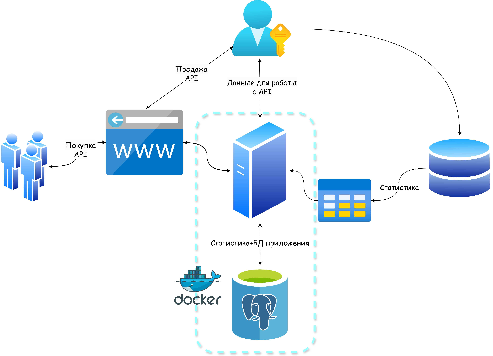

### Модели процессов
Для реализации требований необходимо представить модели процессов регистрации и покупки API 
#### Прототип модели "Регистрация пользователя" 
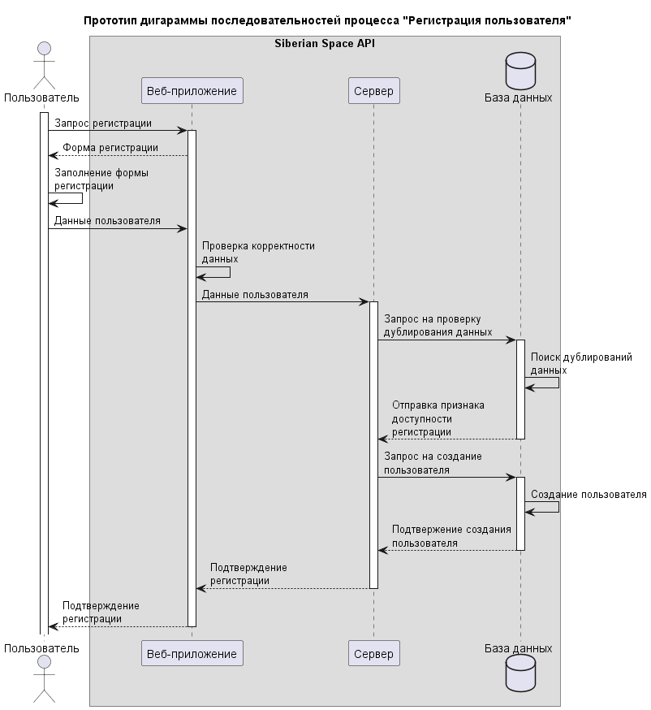

#### Прототип модели "Покупка API"
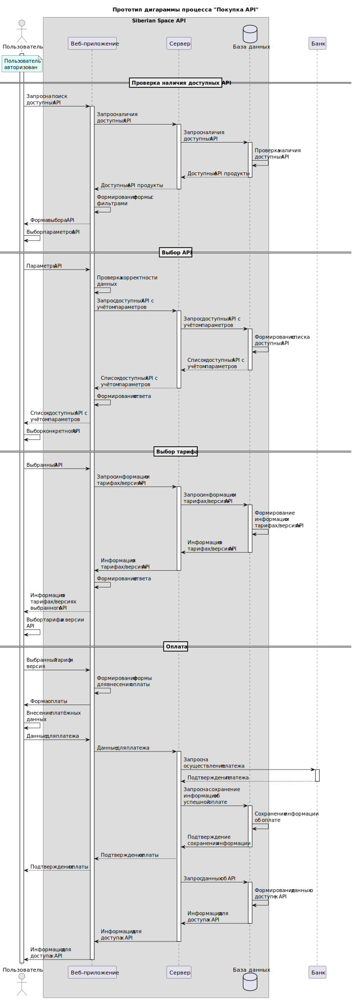

## Структура таблиц
Для работы представлены три справочных таблицы:
* Users: пользователи (покупатели, держатели API)
* API: информация об представленных на сайте API (название, протокол, цена)
* Money_types: информация о типе тарифа API (подписка, покупка на период, оплата за использование)

Три динамические таблицы:
* Money_types_for_each_api: виды монетизации API
* Sales_receipt: чеки (информация о покупках)
* Logs: информация о событиях в базе

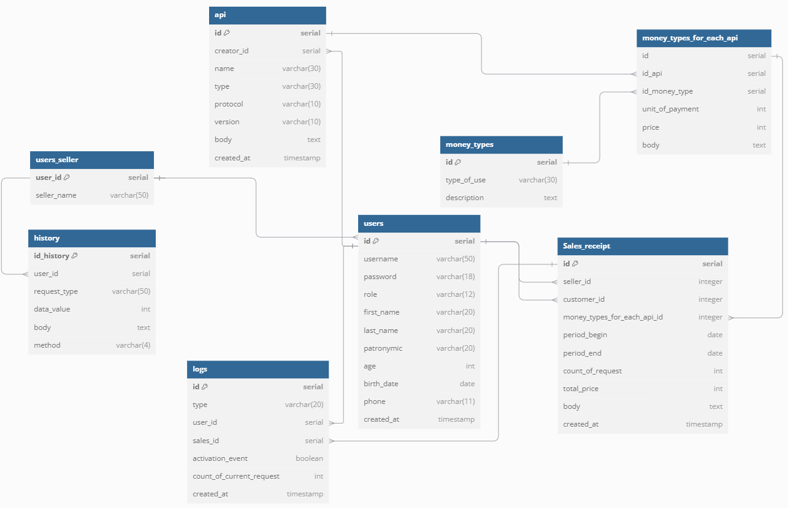
### Суть полей таблицы
1. Users
    * id
    * username 
    * password 
    * role 
    * first_name 
    * last_name 
    * patronymic 
    *  age 
    * birth_date 
    * phone 
    * created_at

2. Api
    *  id счетчик 
    *  creator_id id создавшего пользователя 
    *  name название API 
    *  type тип APi (REST, SOAP, WebSocket...)
    *  protocol протокол, использующийся API (HTTPS, WS, XMPP...)
    *  version версия API
    *  body комментарий
    *  created_at дата выгрузки API на сайт

1.  Money_types
    * id счетчик
    * types_of_use тип тарифа (подписка, покупка на период, оплата за использование...)
    * description описание

4. Money_types_for_each_api
    * id счетчик
    * id_api ключ API
    * id_money_type ключ типа тарифа
    * unit_of_payment единица измерения (использование, день, месяц...)
    * price цена за единицу
    * body  комментарий

5. Sales_receipt
    * id счетчик
    * seller_id ссылка на продавца
    * customer_id ссылка на покупателя
    * money_types_for_each_api_id ссылка на тариф
    * period_begin начало периода (пустое, если подписка не на период)
    * period_end конец периода (пустое, если подписка не на период)
    * count_of_request количество использований (пустое, если тариф не на использование)
    * total_price итоговая цена (расчетная цена за период или количество использований)
    * body комментарий 
    * created_at дата покупки

6. Logs
    * id счетчик
    * type тип события
    * user_id пользователь, породивший событие
    * sales_id привязынная покупка (если есть)
    * activation_event факт активации подписки (если есть)
    * count_of_current_request количество выполненных запросов (если есть)
    * created_at дата события

## Формирование базы данных
База данных представлена на языке PostgreSQL 
Скрипт на создание базы [здесь](./APIsearch/DataBase/create.sql)

## Прототип сайта

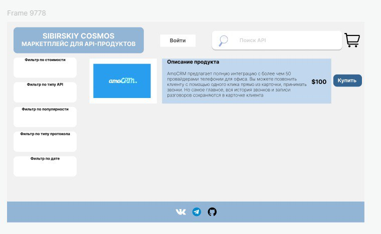

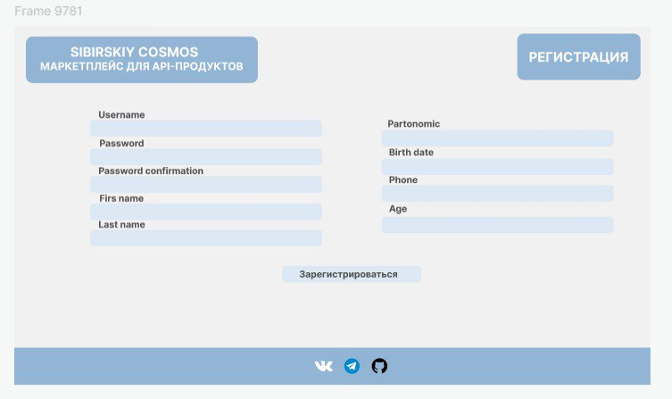

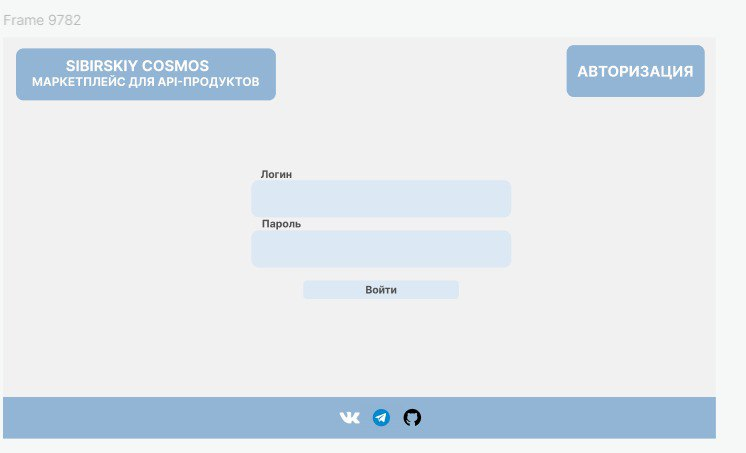

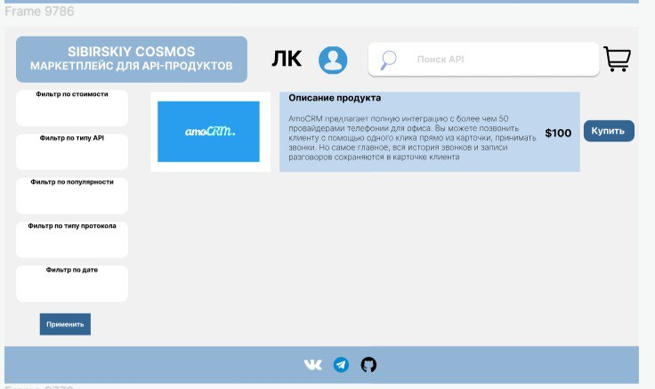
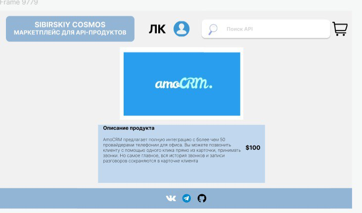
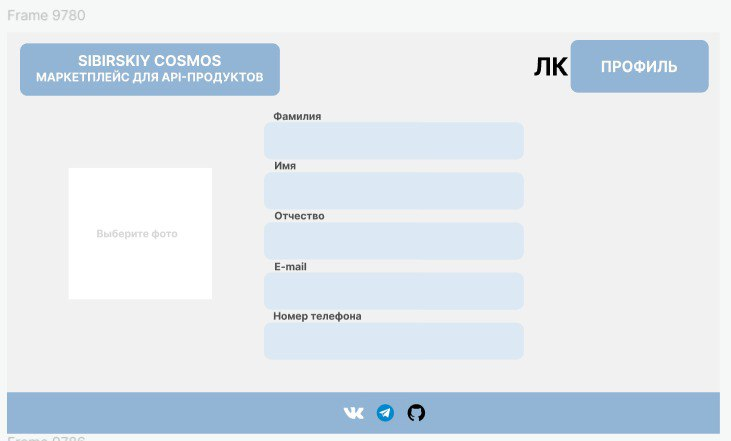

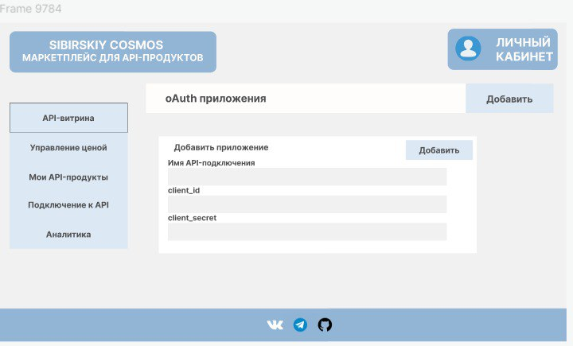
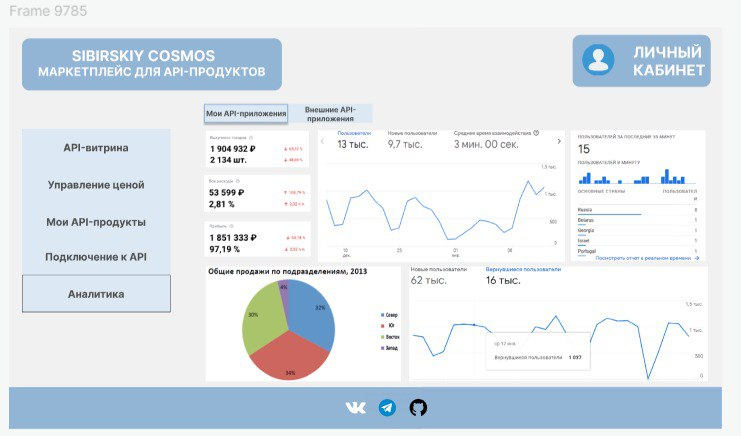

## Реализованный сайт

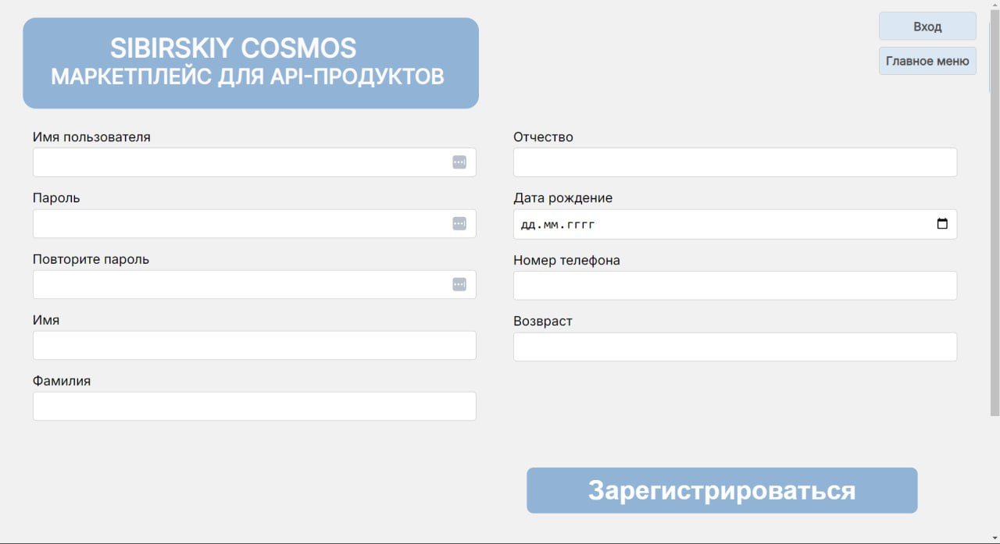

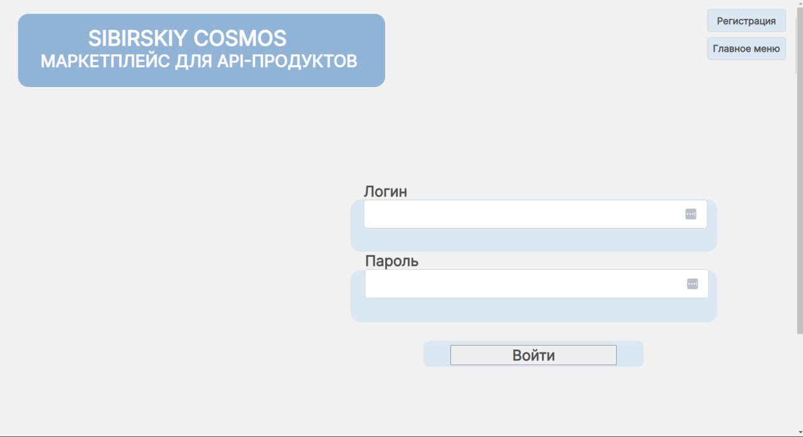

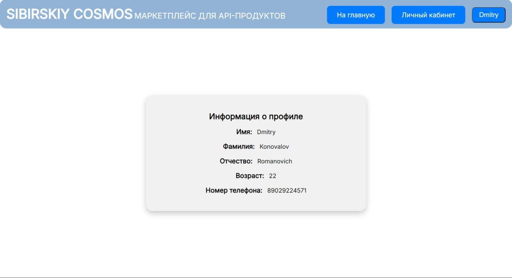

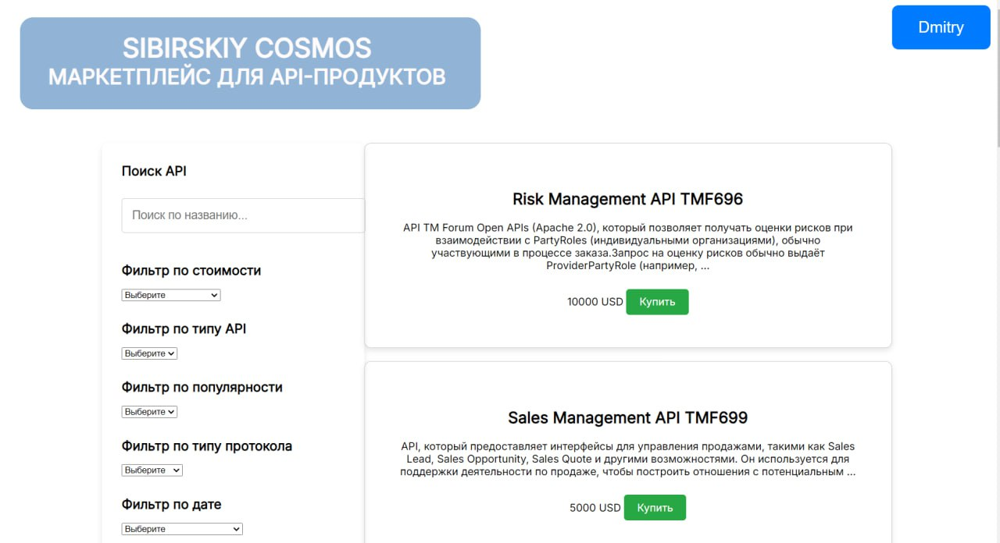

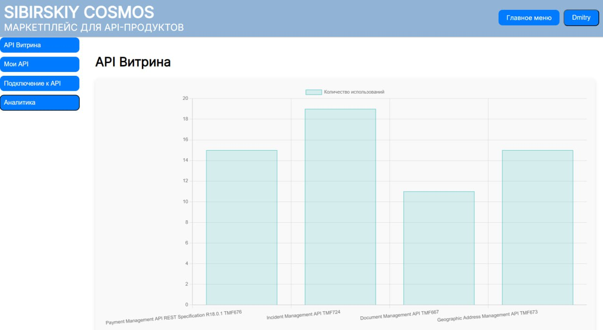

## Стек технологии
* *Frontend:* HTML, CSS, JavaScript создания удобного и функционального интерфейса.

* *Backend:* Python с использованием фреймворка Django для обработки запросов и управления бизнес-логикой.

* *База данных:* Реляционная СУБД PostgreSQL для хранения данных.

* *API:* RESTful API для взаимодействия между frontend и backend частями приложения.

* *Среда разработки:* Pycharm и VScode

